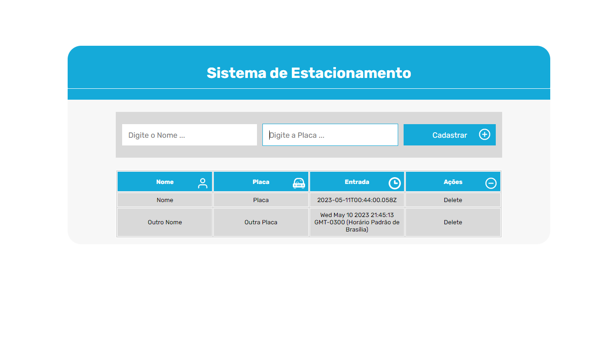
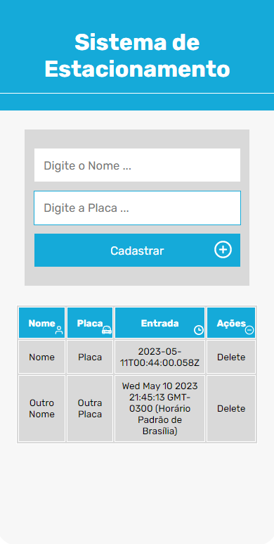

# Sistema de Estacionamento.


Projeto de um sistema de estacionamento, com as funcionalidades de cadastrar e remover veiculos.


##### Previa Desktop

##### Previa Mobile



#### Principais funcionalidades

- [X] Adicionar Veiculos ao Patio
- [X] Ver listagem dos Veiculos no Patio
- [X] Remover Veiculos do Patio

## 💻 Pré-requisitos

Antes de começar, verifique se você atendeu aos seguintes requisitos:

* Você instalou a versão mais recente de `<node JS / gitbash>`
* Você tem uma máquina `<Windows / Linux / Mac>`.

## 🚀 Instalando <sistema-estacionamento>

Para instalar o <sistema-estacionamento>, siga estas etapas:

Abra o terminal no diretorio que voce deseja instalar o app
```
<git clone https://github.com/jumaelmartins/sistema-estacionamento.git>
```

## ☕ Usando <sistema-estacionamento>

Para usar <sistema-estacionamento>, siga estas etapas:

Com o terminal aberto na pasta raiz do projeto insira os comandos abaixo:
```
instalar dependencias
<npm i>
```

```
iniciar o servidor em ambiente de densevolvimento
<npm run dev>
```

Opcional

```
iniciar o servidor em ambiente de produção
<npm run build>
<npm run preview>
```

## 🚧 Ferramentas Utilizadas no desenvolvimentoo:

- TypeScript
- Flexbox
- SASS / SCSS
- Mobile First
- Vite

## 💥O que aprendi ao desenvolver esse projeto:

- Primeiros Passos Utilizando TypeScript
- Tipagem basica dos Dados
- Definição de Interfaces

## 📫 Contribuindo para <sistema-estacionamento>

Para contribuir com <sistema-estacionamento>, siga estas etapas:

1. Bifurque este repositório.
2. Crie um branch: `git checkout -b <nome_branch>`.
3. Faça suas alterações e confirme-as: `git commit -m '<mensagem_commit>'`
4. Envie para o branch original: `git push origin <sistema-estacionamento> / <local>`
5. Crie a solicitação de pull.

Como alternativa, consulte a documentação do GitHub em [como criar uma solicitação pull](https://help.github.com/en/github/collaborating-with-issues-and-pull-requests/creating-a-pull-request).


